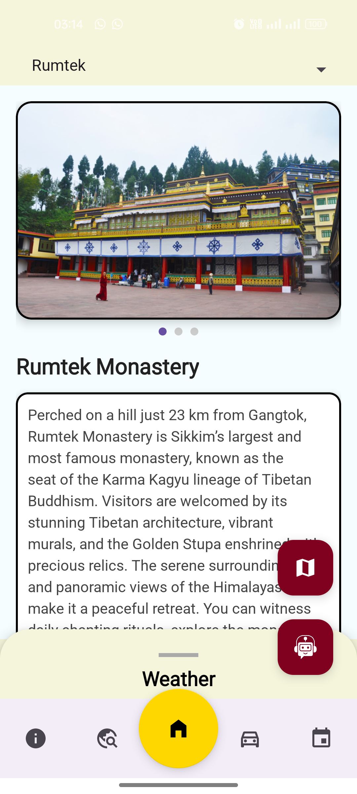
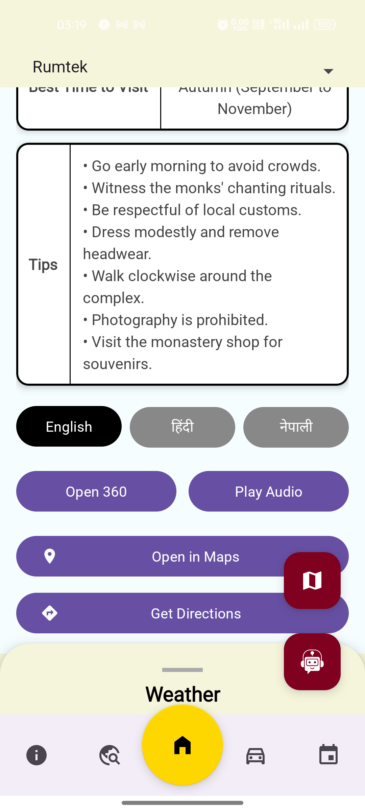
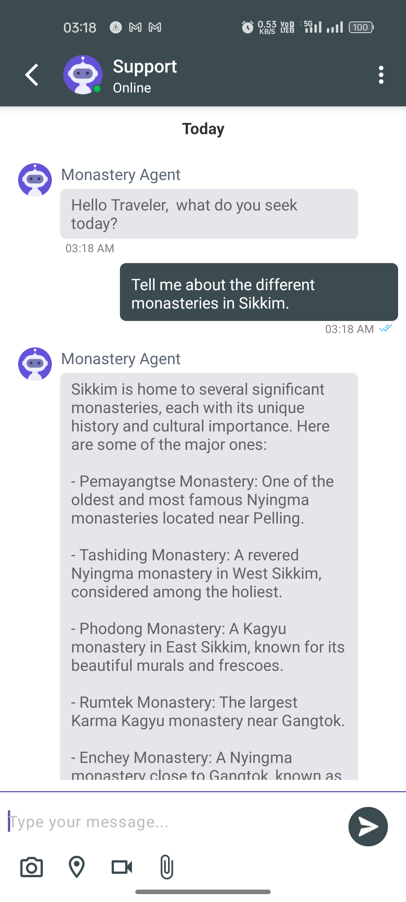

# Monastery360 - A Spiritual Virtual Tour 🧘‍♂️🕉️

-lightgrey)


> **Note:** Monastery360 is a Hackathon project.

**Monastery360** is a comprehensive virtual tourism application designed to provide an immersive experience of the sacred monasteries in Sikkim. By leveraging 360-degree panoramas and sensor-based controls, users can "walk through" these spiritual landmarks with ease.

---

## 📖 The "Why" Behind Monastery360

Traveling to remote Himalayan monasteries can be physically and logistically challenging. Monastery360 aims to make these spiritual sites accessible to:

1.  **Global Seekers:** Anyone interested in Buddhist culture and architecture who cannot travel to Sikkim.
2.  **Immersive Travelers:** Users who want to scout locations before their physical visit.
3.  **Spiritual Inclusion:** Providing a virtual pilgrimage experience for the elderly or those with mobility issues.

---

## 📸 Screenshots

       

---

## ✨ Key Features

* **360° Immersive Tours:** High-resolution spherical panoramas of major monasteries including Rumtek, Enchey, and Dubdi.
* **Gyroscope Navigation:** Use your device's movement to look around the virtual space naturally.
* **Real-time Weather Intelligence:** Integrated weather forecasts via OpenMeteo to help plan physical visits.
* **Offline Maps:** Powered by Mapsforge, allowing users to navigate even in areas with poor connectivity.
* **AI Spiritual Assistant:** A built-in chatbot (Kommunicate) to answer queries and provide support.
* **Travel Companion:** Detailed information on permits, cabs, local events, and hotels.

---

## 🛠 Tech Stack

* **Language:** Java
* **Network:** Retrofit & OkHttp (for weather and API interactions)
* **Architecture:** MVVM concepts with Fragments for modular UI.

### Virtual Reality & Graphics
* **PanoramaGL:** Core engine for rendering 360° spherical panoramas.
* **Gyroscope Sensors:** Custom controllers for motion-tracked navigation.
* **Glide:** Efficient image loading and caching.

### Key Libraries
* **[Mapsforge](https://github.com/mapsforge/mapsforge):** For high-performance offline vector maps.
* **[Kommunicate](https://www.kommunicate.io/):** AI-powered customer support and chatbot integration.
* **[MaterialCalendarView](https://github.com/prolificinteractive/material-calendarview):** For tracking monastery events and festivals.
* **[PhotoView](https://github.com/chrisbanes/PhotoView):** For interactive image zooming.
* **Gson:** Data serialization for API responses.

---

## 🚀 How to Run

1.  **Clone the repository:**
    ```bash
    git clone https://github.com/YOUR_USERNAME/Monastery360.git
    ```

2.  **Open in Android Studio:**
    Open the project directory in Android Studio.

3.  **Configure API Keys:**
    Create a `local.properties` file in the root directory and add your Kommunicate App ID:
    ```properties
    KOMMUNICATE_APP_ID=your_kommunicate_app_id_here
    ```

4.  **Build and Run:**
    Sync Gradle and run the app on an emulator or physical device (Min SDK: API 24+).

---

## 📄 License

This project is licensed under the MIT License - see the [LICENSE](LICENSE) file for details.

---

## 💡 Support the Project

If you find this project helpful or believe in the mission of digitalizing spiritual heritage, feel free to:

* ⭐ Star this repository.
* 🍴 Fork it and contribute new monastery panoramas.
* 📢 Share it with fellow travelers and spiritual seekers.

**Developed with ❤️ by Nishkarsh (ForTheEase)**
